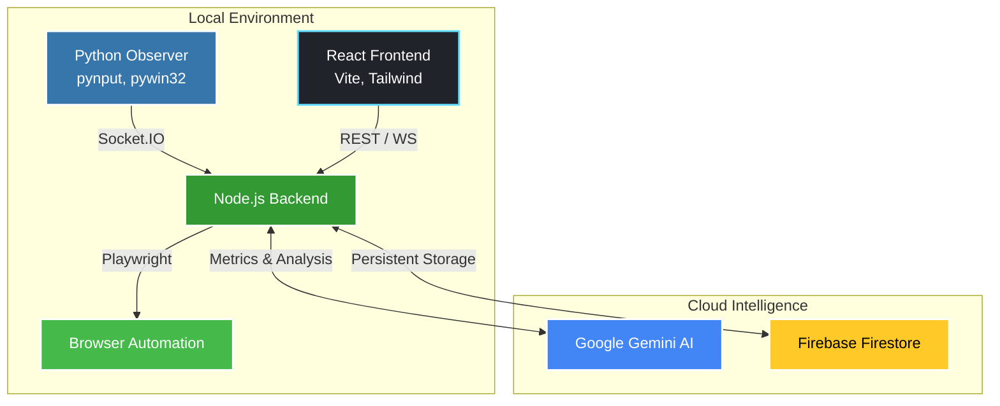
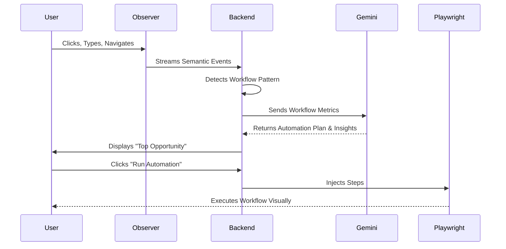

<div align="center">
  
  <h1>🤖 WorkTwin</h1>
  <p><b>Your AI Work Partner</b></p>
  <p>An intelligent, autonomous workspace assistant that watches how you work, finds automation opportunities, and executes them for you.</p>

  <p>
    
    
    
    
    
    
    
  </p>
</div>

---

## 🌟 Overview

**WorkTwin** is a comprehensive AI automation system designed to bridge the gap between manual repetitive tasks and full automation. It consists of three main pillars:
1. **Desktop Observer:** A local python agent that silently maps your user journey, recognizing interactive elements, key presses, and window context.
2. **Intelligence Engine:** Powered by Google Gemini, the engine identifies workflow inefficiencies (repetitive sequences, high friction, context switching) and suggests an *Automation Plan*.
3. **Execution Engine:** A Playwright-powered runner that can automatically replay the optimized AI-generated workflows on your browser.

## 🚀 Key Features
- 👁️ **Real-time Semantic Observation:** Tracks what you do, not just where you click.
- 🧠 **AI Analytics:** Automatically detects repetitive patterns and calculates Friction/ROI metrics.
- ⚡ **Auto-Execution:** Re-runs your recorded workflows deterministically using an integrated browser engine.
- 📊 **Beautiful Dashboard:** Monitor your activity, visualize bottlenecks, and trigger automations with a single click.

---

## 🏗️ Architecture



---

## 📊 Analytics & Flow Detection

WorkTwin evaluates workflows using a multi-dimensional metric system. The engine calculates the **Friction Score** and **Automation Potential** based on:
- Total Duration & Idle Time
- Application Context Switches
- Copy/Paste Rework Events
- Semantic Element Targets



---

## ⚙️ Setup & Installation

This project requires three concurrent processes to be running:

### 1. Database & AI Credentials
Ensure you have your `.env` configured in the backend with:
```env
GEMINI_API_KEY=your_google_gemini_key
```

### 2. Start the Backend (Node.js)
```bash
cd backend
npm install
npm run dev
```

### 3. Start the Frontend (React)
```bash
cd frontend
npm install
npm run dev
```

### 4. Start the Desktop Observer (Python)
*Must be run on a Windows machine for active window tracking.*
```bash
cd observer
python -m venv venv
venv\Scripts\activate
pip install -r requirements.txt
python main.py
```

---

## 🛠️ Built With Love
Developed with modern web technologies and the latest in Generative AI, WorkTwin transforms how we think about personal robotic process automation.
