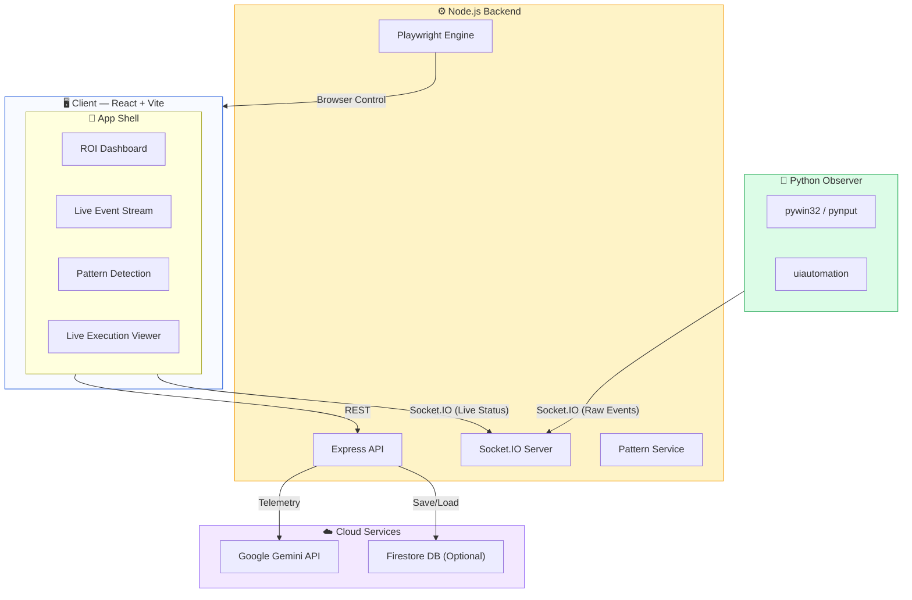

<div align="center">

# 🤖 WORKTWIN

### Your AI Work Partner

**"Stop repeating yourself. Let WorkTwin do the heavy lifting."**

[](#)
[](https://react.dev)
[](https://nodejs.org)
[](https://playwright.dev)
[](https://python.org)
[](https://deepmind.google/technologies/gemini/)
[](https://tailwindcss.com)

<br/>

<p align="center">
  
</p>

<br/>

> **WorkTwin** is an AI-powered workspace automation tool that silently observes your desktop workflows, analyzes inefficiencies, and autonomously executes optimizations using Google Gemini and Playwright — acting as your personalized digital twin.

</div>

---

## 📖 Table of Contents

- [The Problem](#-the-problem)
- [Our Solution](#-our-solution)
- [Core Pipeline](#-core-pipeline)
- [Key Features](#-key-features)
- [Architecture](#-architecture)
- [Getting Started](#-getting-started)
- [License](#-license)

---

## 🔴 The Problem

Knowledge workers spend countless hours on highly repetitive, copy-paste tasks, yet:

- **40%** of a typical workday is spent on manual data entry and context switching.
- **Traditional RPA** (Robotic Process Automation) requires complex programming and rigid selectors.
- Most users **don't know** exactly *what* they should automate until they see the analytics.
- Small friction points (like switching between 4 apps to complete one task) silently drain productivity.

> There is no simple tool that *watches* how you work and *automatically* builds the robot for you.

---

## 💡 Our Solution

**WorkTwin** acts as an intelligent digital twin that bridges observation and execution:

```
   👤 Human Worker
         │
         ▼
   ┌─────────────┐
   │  WORKTWIN   │──── "Let me do that for you"
   │  AI Agent   │
   └──────┬──────┘
          │
    ┌─────┼─────┬─────────┬──────────┐
    ▼     ▼     ▼         ▼          ▼
 Observe  Detect   Analyze    Plan     Execute
 (Python) (Engine) (Gemini)  (Steps) (Playwright)
```

Instead of writing scripts, you simply **do your job normally**, and WorkTwin:

1. **Observes** your actions semantically (UI elements, text, URLs).
2. **Detects** repetitive workflow patterns automatically.
3. **Analyzes** friction, ROI, and time saved using AI.
4. **Plans** a deterministic automation script.
5. **Executes** the task on your behalf in a live browser.

---

## 🔄 Core Pipeline

```mermaid
flowchart LR
    A["👁️ Desktop Observer<br/><i>Tracks clicks, typing,<br/>app context, keys</i>"] --> B["🧠 Intelligence Engine<br/><i>Detects patterns &<br/>calculates friction</i>"]
    B --> C["🤖 Gemini AI<br/><i>Generates semantic<br/>automation plan</i>"]
    C --> D["📊 Opportunity Dashboard<br/><i>Displays ROI &<br/>Time Saved</i>"]
    D --> E["⚡ Execution Engine<br/><i>Live browser<br/>automation</i>"]
    E --> F["📋 Activity Tracker<br/><i>Real-time execution<br/>monitoring</i>"]

    style A fill:#e8eeff,stroke:#1a56db,color:#111
    style B fill:#fef3c7,stroke:#f59e0b,color:#111
    style C fill:#dcfce7,stroke:#16a34a,color:#111
    style D fill:#fce7f3,stroke:#ec4899,color:#111
    style E fill:#e8eeff,stroke:#1a56db,color:#111
    style F fill:#f3e8ff,stroke:#8b5cf6,color:#111
```



---

## ✨ Key Features

### 👁️ Semantic Observation
Not just X/Y coordinates. The Python observer maps real UI elements, application names, and window titles, allowing WorkTwin to understand *what* you are doing, not just *where* your mouse is.

### 🧠 Intelligent Workflow Detection
Groups raw events into structured sessions and identifies repetitive workflows. Calculates a **Friction Score** based on app switching, rework, and copy-paste operations.

### 🤖 Gemini-Powered Automation
Passes workflow telemetry to Google Gemini to deduce intent. Gemini extracts URLs, maps semantic targets, and outputs a deterministic JSON automation plan.

### ⚡ Autonomous Playwright Execution
A robust execution engine that takes the AI's semantic plan and brings it to life. It auto-initializes a Chromium browser, navigates to targets, and elegantly handles missing targets or dynamic wait times.

### 📊 Beautiful ROI Dashboard
Visualize your productivity. See your top automation opportunities ranked by estimated time savings and friction reduction, complete with a beautifully crafted dark-mode React interface.

---

## 🏗️ Architecture

### System Architecture



---

## ⚙️ Getting Started

### Prerequisites
- Node.js v18+
- Python 3.11+ (Windows recommended for full UI tracking)
- Google Gemini API Key

### 1. Setup Backend
```bash
cd backend
npm install
# Create a .env file with GEMINI_API_KEY=your_key
npm run dev
```

### 2. Setup Frontend
```bash
cd frontend
npm install
npm run dev
```

### 3. Setup Observer
```bash
cd observer
python -m venv venv
venv\Scripts\activate
pip install -r requirements.txt
python main.py
```

---

## 📜 License

Distributed under the MIT License. See `LICENSE` for more information.
